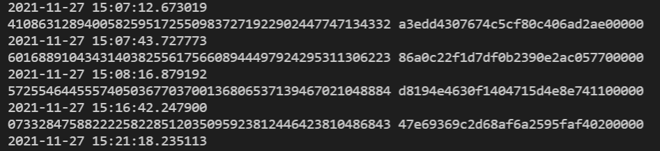

## IO-bound. Проверяем ссылки на страницах Википедии

### Замерьте время синхронной проверки ссылок.

Время запуска проверки

Время завершения проверки

#### Итог: 33 минуты

5 воркеров: пиковая загрузка процессора 1 %, память 50 мб, время работы: 7:50 10 воркеров: пиковая загрузка процессора
2.5 %, память 60 мб, время работы: 8 минут

100 воркеров: пиковая загрузка процессора 10 %, память 330 мб, время работы: 3:10 минут

#### Итог: незначительно возрастает использование процессора, сильно возрастает использование памяти. Большой выигрыш в производительности при увеличении количества воркеров.

## CPU-bound. Генерируем монетки

Время генерации 4 монет на одном ядре: 14 минут

2 воркера: 35 секунды, загрузка процессора 40 % 4 воркера: 70 секунд, загрузка процессора 60 % 5 воркеров 5 секунды,
загрузка процессора 75 % 6 воркеров 55 секунд, загрузка процессора 90 % 10 воркеров: 25 секунд, загрузка процессора 100
% 61 воркер: 15 секунд, загрузка процессора 100 %

* Время генерации 4 монет

#### Итог: Генерация монет выполняется случайным образом. Генерация происходит быстрее при большем количестве воркеров.

#### Для полной утилизации ресурсов процессора достаточно количества воркеров равное количеству потоков процессора (В моём случае - 8).

#### Использование памяти: 7 Мб * <Количество воркеров (процессов)>