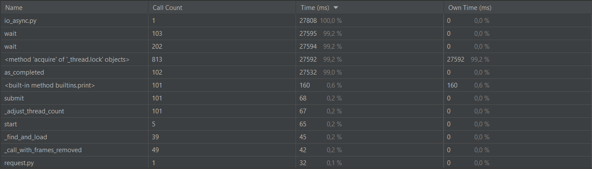
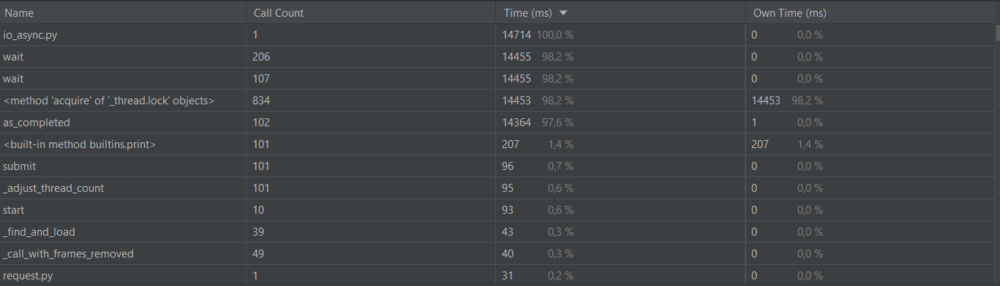
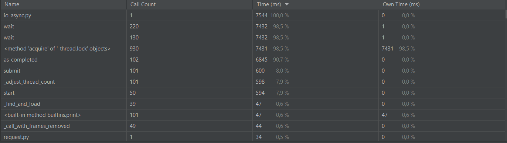
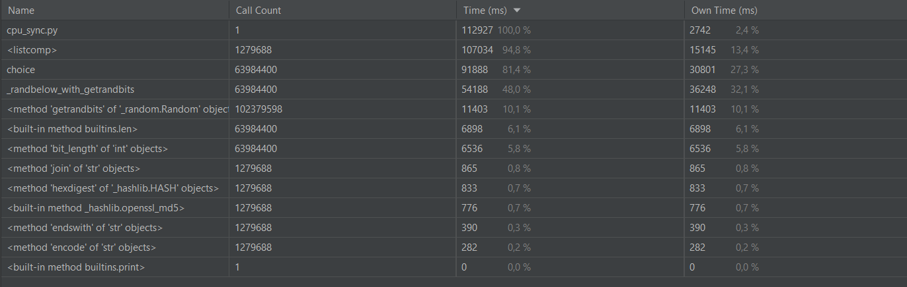
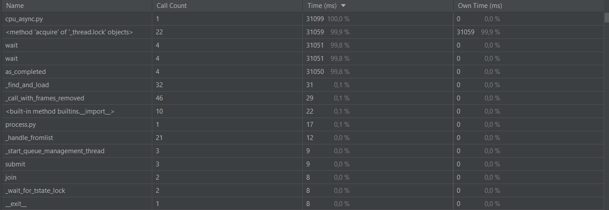
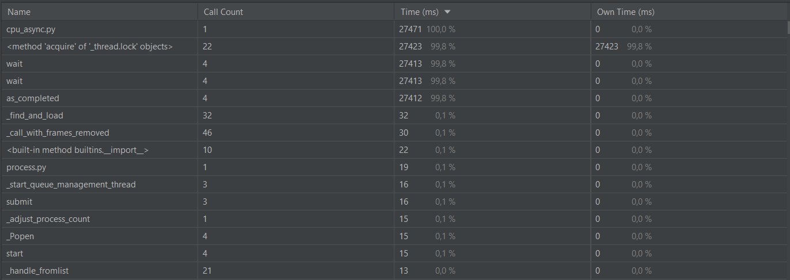
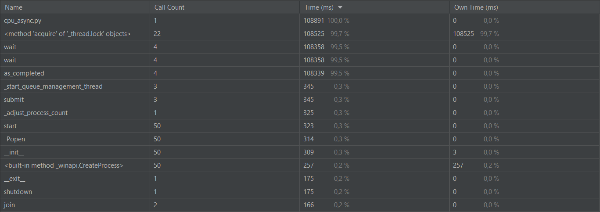

# Отчет
## Задача IO Bound
### Синхронный проход по 100 ссылкам

### Ассинхронный проход по 100 ссылкам
* 5 воркеров

* 10 воркевор

* 50 воркеров

Наглядно можно увидеть, что скрость работы программы увеличивается 
с увеличением количества потоков

## Задача CPU Bound
### Синхронный поиск одной монеты

### Асинхронный поиск 3 монет
* 2 воркера

* 4 воркера

* 50 воркеров

С увеличением количества процессов, скорость работы программы так же увеличивается, 
но только до тех пор пока не превышает количество логических ядер компьютера, 
в противном случае, скрость работы может даже ухудшиться.
