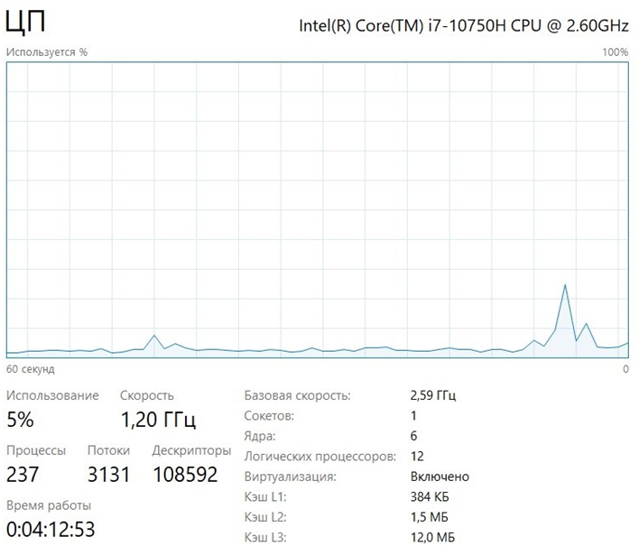
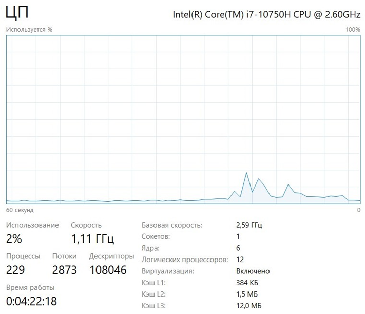
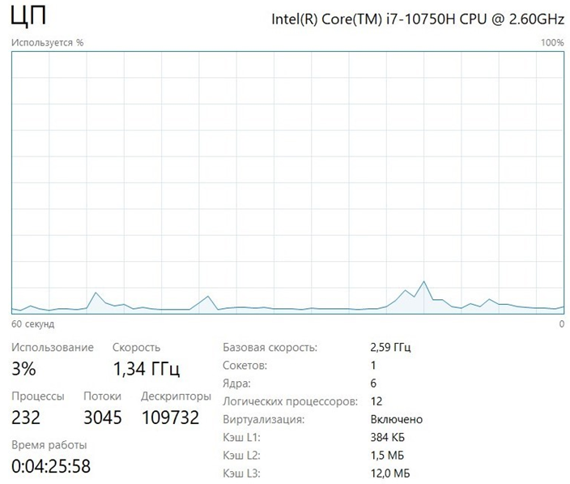
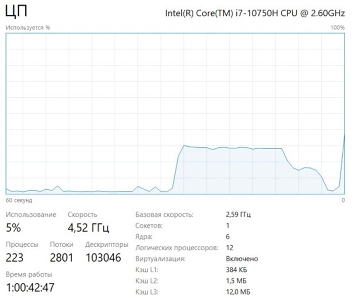
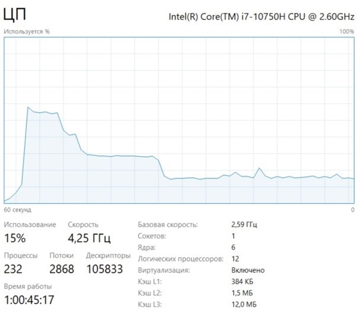
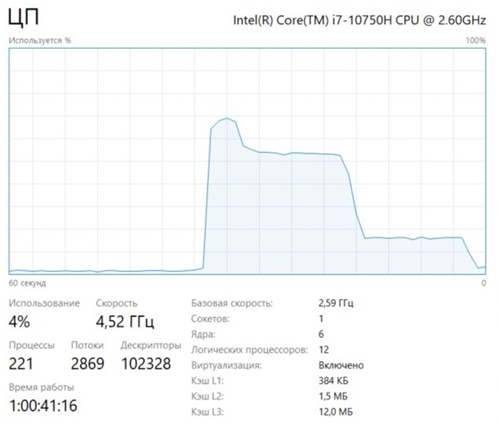
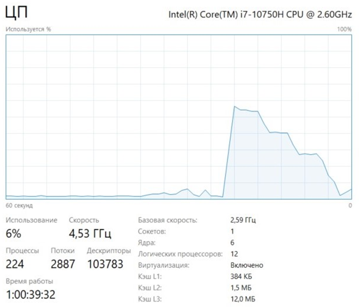
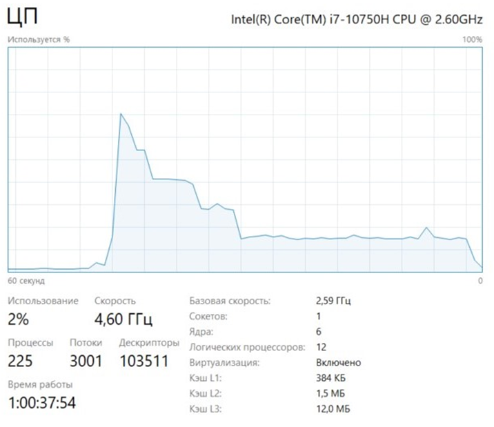

# Первое задание
### из 5 воркеров время работы составляет 36020 ms

### из 10 воркеров время работы составляет 24530 ms

### из 100 воркеров время работы составляет 18600 ms

#### Чтобы увеличить скорость проверки ссылок, надо использовать ThreadPoolExecutor. 
#### Если изменять количество воркеров, то существенно это не влияет на загрузку памяти и процессора. Но, как можно заметить по данным выше, увеличение количества воркеров приводит к уменьшению времени работы программы, а также к увелечению активности отправки и получения в сети.

# Второе задание
#### Генерация одной монеты на одном ядре в среднем занимает от 40000 до 60000ms.
### из 2 воркеров время генерации пяти монет составляет 29743 ms

### из 4 воркеров время генерации пяти монет составляет 27192 ms

### из 5 воркеров время генерации пяти монет составляет 24130 ms

### из 10 воркеров время генерации пяти монет составляет 26391 ms

### из 100 воркеров время генерации пяти монет составит 22815 ms

#### Исходя из данных выше видно, что изменение количества воркеров влияет на загрузку памяти и процессора. 