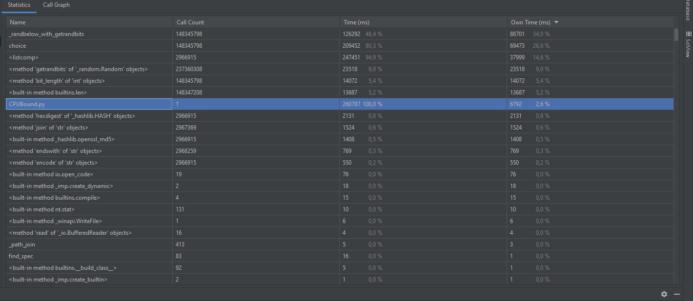
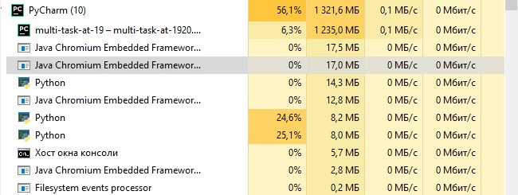

#IO-bound:
###Синхронно в 1 поток:

###5 воркеров:

###10 воркеров

###100 воркеров

Количество памяти и нагрузка на ЦП не изменяется практически совсем,
количество воркеров только немного отображается на загруженности сети, график которой выглядит следующим образом:

#CPU-Bound
###1 ядро для 3х монет:

###2 ядра для 3х монет:

###4 ядра для 3х монет:

###5 ядер для 3х монет:

###10 ядер для 3х монет:

После 4 воркеров, очевидно, разница уже пропала. (процессор i3-4330)
Результаты все равно немного отличаются, так как скорость выполнения программы
так или иначе зависит от рандома, но в целом у 4, 5 и 10 воркеров они идентичны 