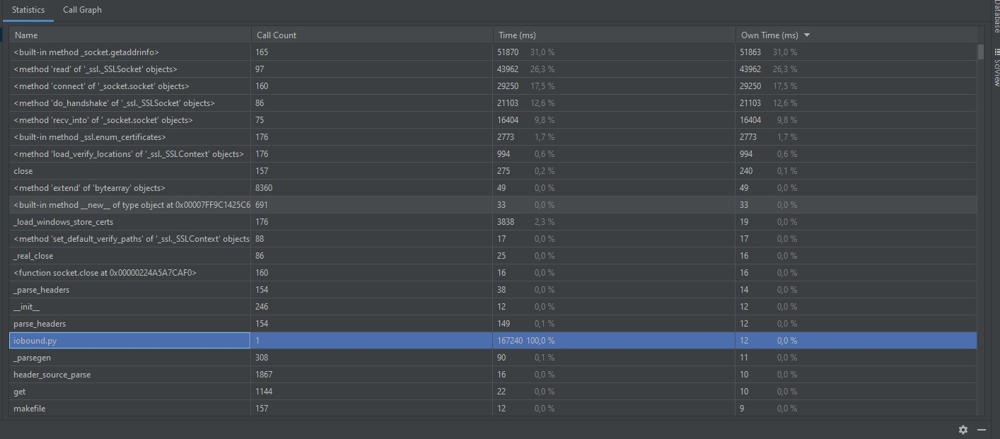

#IO-bound:
###Синхронно в 1 поток:

###5 воркеров:

###10 воркеров

###100 воркеров

Количество памяти и нагрузка на ЦП не изменяется практически совсем,
количество воркеров только немного отображается на загруженности сети, график которой выглядит следующим образом:
