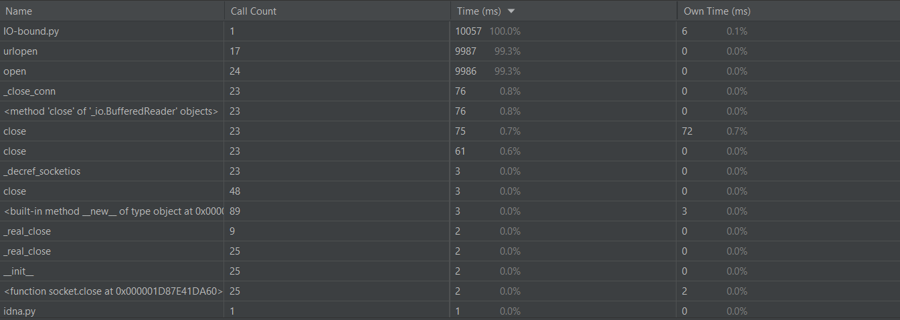
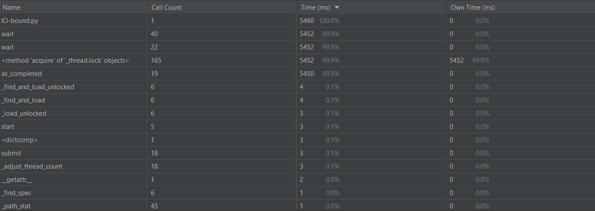
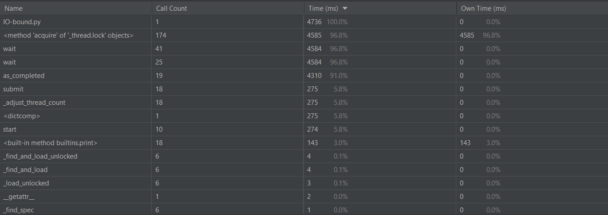
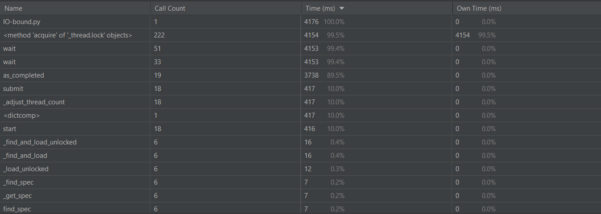
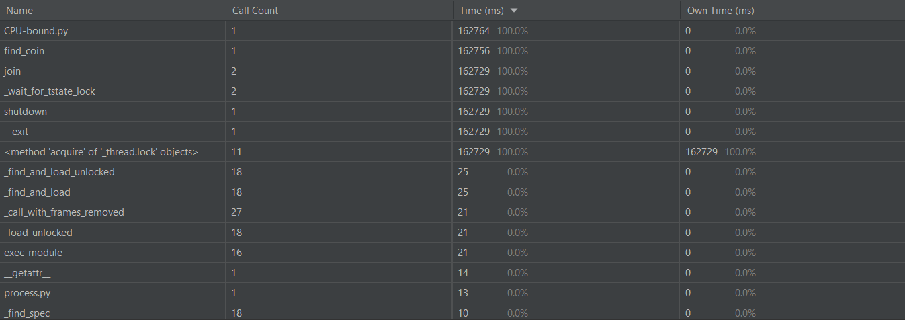
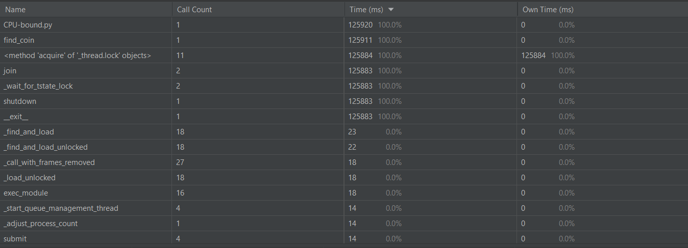
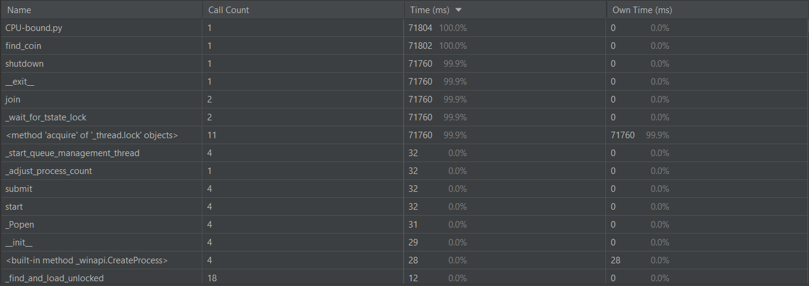
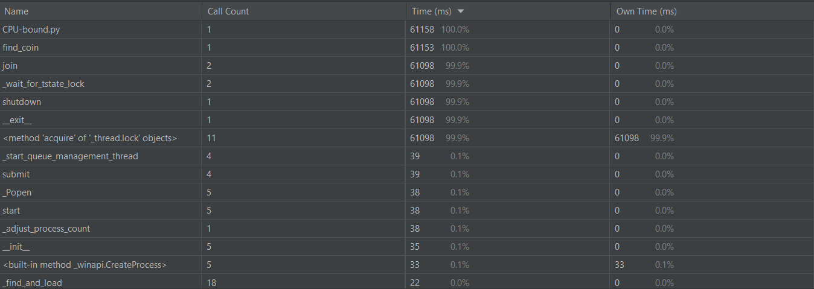
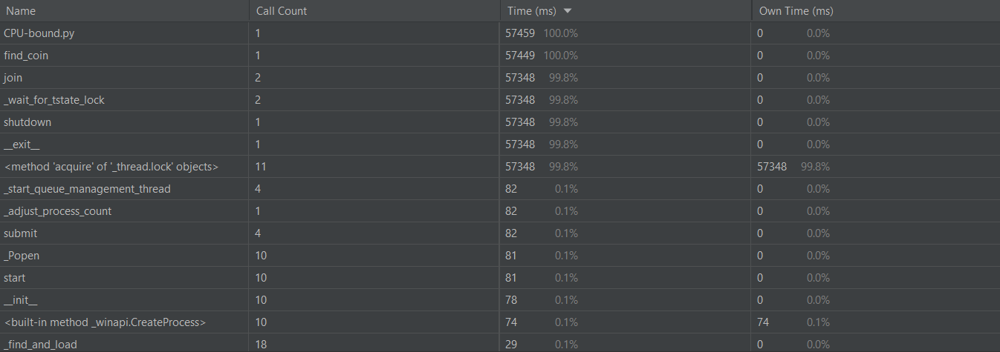
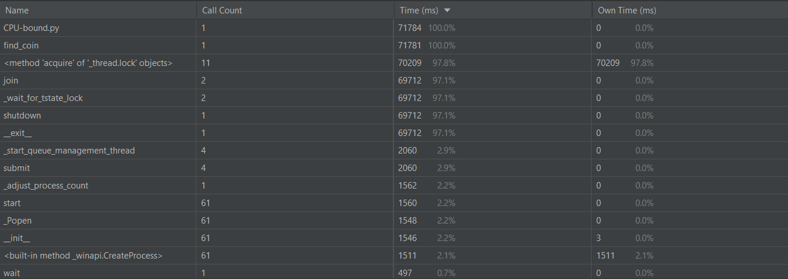

# Отчет по работе «Параллелизм и асинхронность»
IO-BOUND
Время работы IO_bound.py при синхронной проверке ссылок – 10057 ms

Перепишем код, используя ThreadPoolExecutor. Благодар этому время работы изменилось.
Когда количество воркеров(потоков):
5 - 5460 ms

10 - 4736 ms

100 - 4176 ms

Таким образом, при увеличение количества потоков,  увеличение используемой памяти и загрузки процессора не происходит, и при этом дает выигрыш в скорости (времени) выполнения кода.

#CPU-BOUND
Время генерации четырех монет - 162764 ms

Перепишем код используя ProcessPoolExecutor. 
При max_workers=2 время работы - 125920 ms

При max_workers=4 время работы - 71804 ms

При max_workers=5 время работы - 61158 ms

При max_workers=10 время работы - 57459 ms

При max_workers=100 время работы - 71784 ms

Увеличение количества процессов влечет за собой увеличение используемой памяти и загрузки процессора, но при этом дает выигрыш в скорости (времени) выполнения кода, если количество процессов не превышает числа физических ядер
