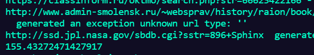
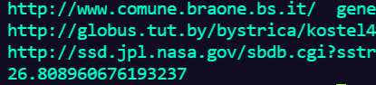
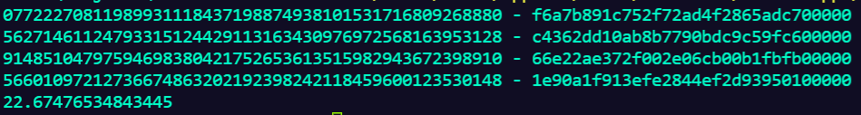
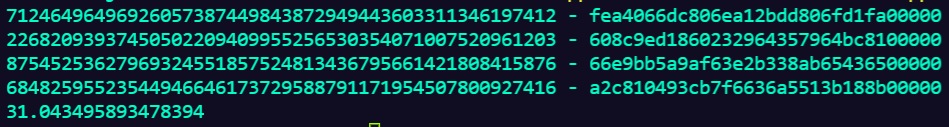
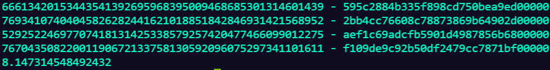
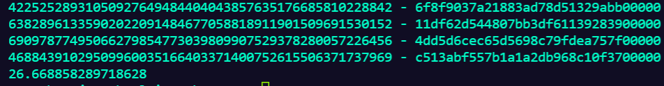

# Параллелизм и асинхронность

# IO Bound

### Замер скорости 1 воркере:
Время: 337 секунд

### Замер скорости 2 воркера:
Время: 155 секунд

### Замер скорости 4 воркера:
Время: 60 секунд

### Замер скорости 10 воркеров:
Время: 35 секунд

### Замер скорости 20 воркеров:
Время: 28 секунд

### Замер скорости 50 воркеров:
Время: 26 секунд

### Замер скорости 100 воркеров:
Время: 27 секунд

Изменение числа воркеров не сильно влияет на загрузку компьютера. 
До 10 потоков потоков наблюдается линейний прирост в скорости. 
После чего происходит происходит небольшой прирост на 20 потоках. 
Далее, вероятно, происходит упор во время ожидания получения информации и никакого прироста не наблюдается.

# CPU Bound

### Замер скорости 1 воркере:

Время: 22 секунды

### Замер скорости 2 воркера:
Время: 31 секунда

### Замер скорости 4 воркера:
Время: 8 секунд

### Замер скорости 10 воркеров:
Время: 14 секунд

### Замер скорости 20 воркеров:
Время: 26 секунд

### Замер скорости 61 воркер:
Время: 90 секунд

При увеличении числа потоков достаточно сильно возрастала нагрузка на процессор.

В тоже время от увеличения потоков свыше 4-х прироста производительности не отмечается.
Так же результаты тестирования сильно отличаются от прогона к прогону, но динамика того, что прироста на числе потоков > 10 нет остаётся верна.