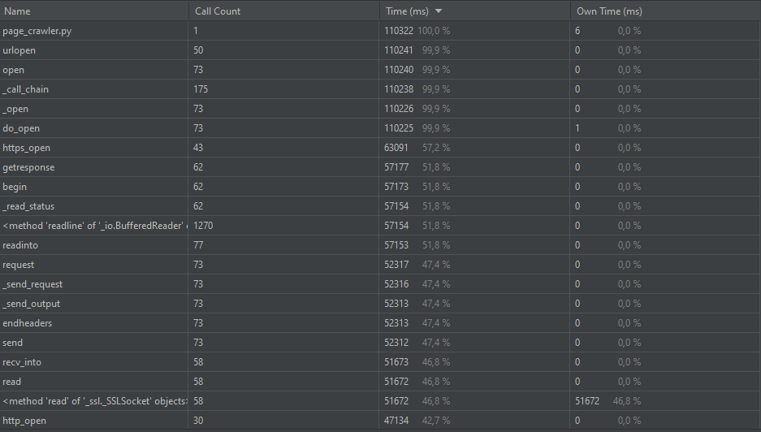
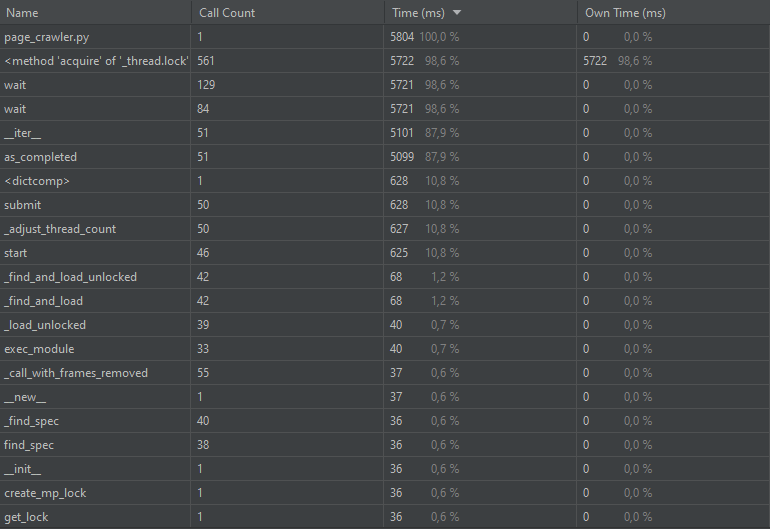

# Проход по 50 случайным ссылкам

## Результаты синхронного прохода

## Результаты асинхронного прохода

| Кол-во потоков  | Время выполнения (мс) |
| ------------- | ------------- |
| 5  | 22134  |
| 10  | 12245 |
| 50  | 5722 |

Так как задача является IO-bound, то скорость выполнения по мере увеличения потоков уменьшается, причем линейно.

#### Отчет профайлера для 50 потоков

