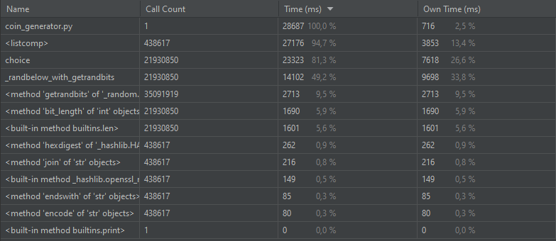
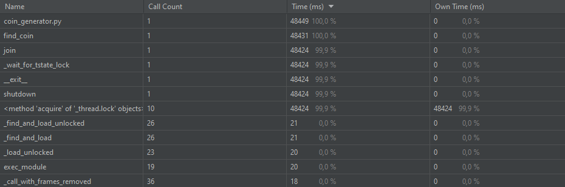
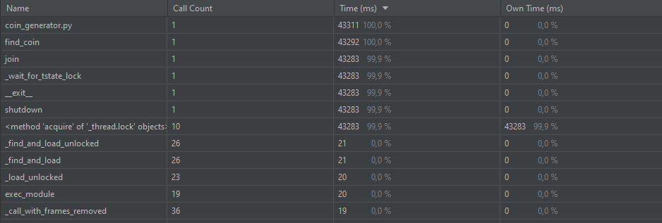
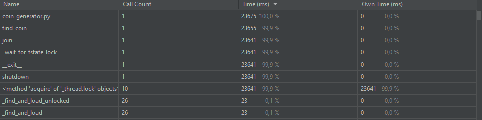
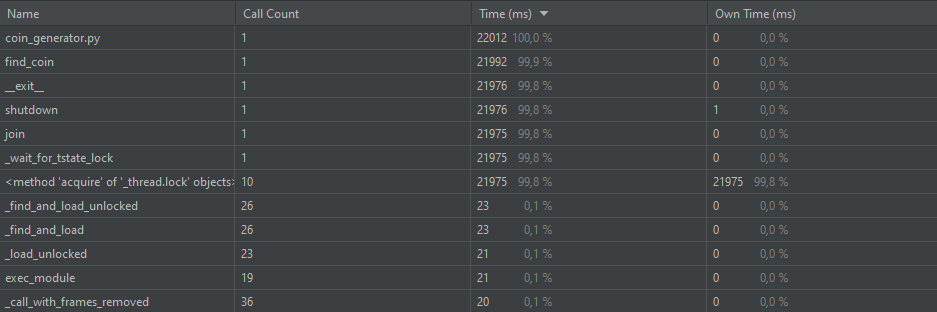
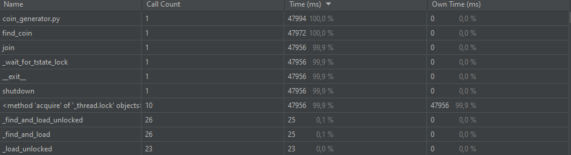

# Проход по 50 случайным ссылкам

## Результаты синхронного прохода

## Результаты асинхронного прохода

| Кол-во потоков  | Время выполнения (мс) |
| ------------- | ------------- |
| 5  | 22134  |
| 10  | 12245 |
| 50  | 5722 |

Так как задача является IO-bound, то скорость выполнения по мере увеличения потоков уменьшается, причем линейно.

#### Отчет профайлера для 50 потоков

# Генерация монет

## Синхронный вариант

Время генерации 1 монеты: 28687

## Асинхронный вариант

Время поиска 4 монет

| Кол-во процессов  | Время выполнения (мс) |
| ------------- | ------------- |
| 1  | 48449  |
| 2  | 43311  |
| 3 | 23675 | 
| 4  | 22012 |
| 8  | 47994 |

Как можно заметить, с увеличением кол-ва процессов, время поиска уменьшается. Однако, при использовании кол-ва процессов
превосходящих кол-во ядер на машине не дает выигрыша по времени, можно сказать, что даже наоборот, замедляет работу.

### Результаты профайлера

#### 1 воркер

#### 2 воркера

#### 3 воркера

#### 4 воркер

#### 8 воркеров

