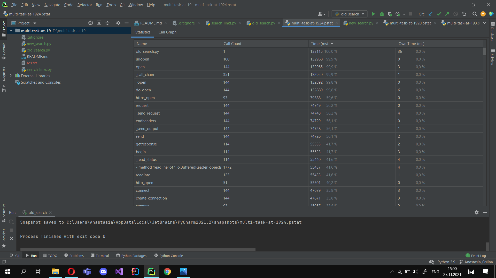
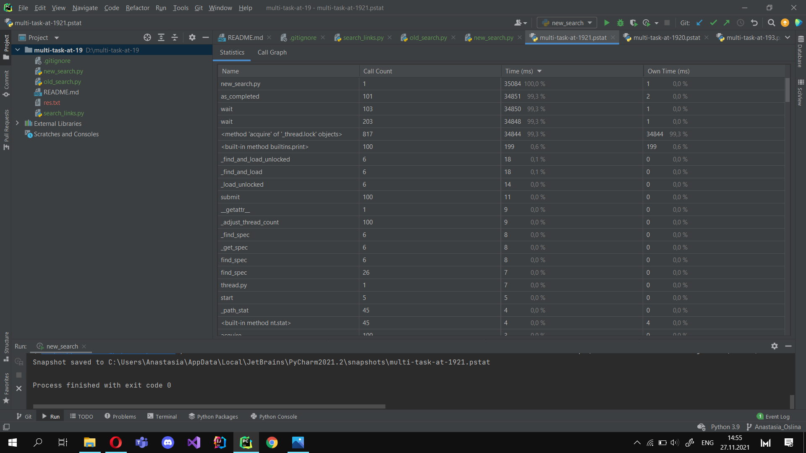
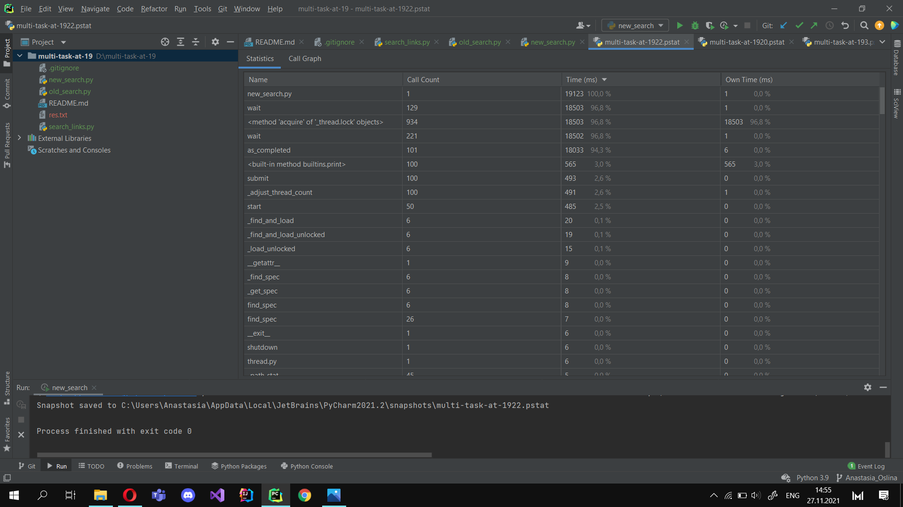
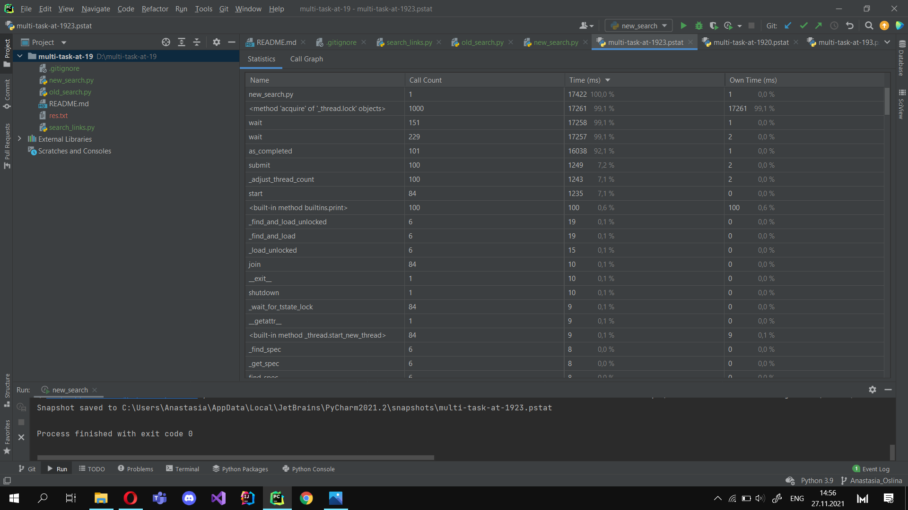
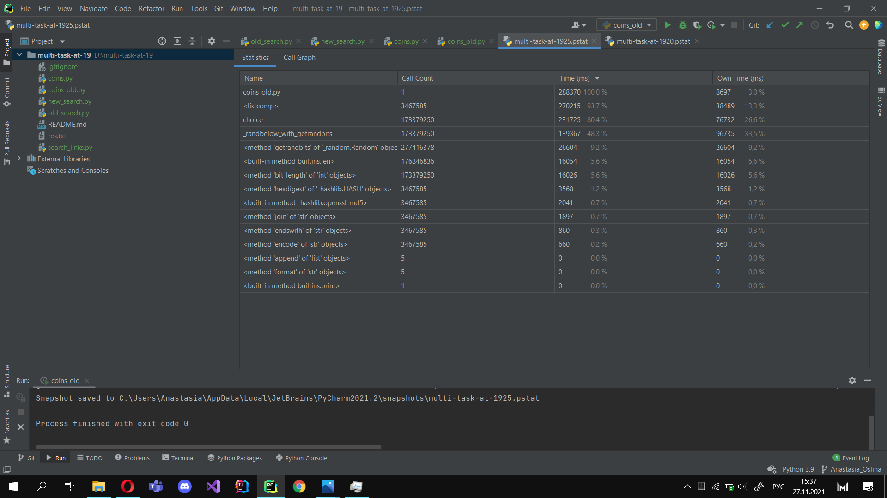
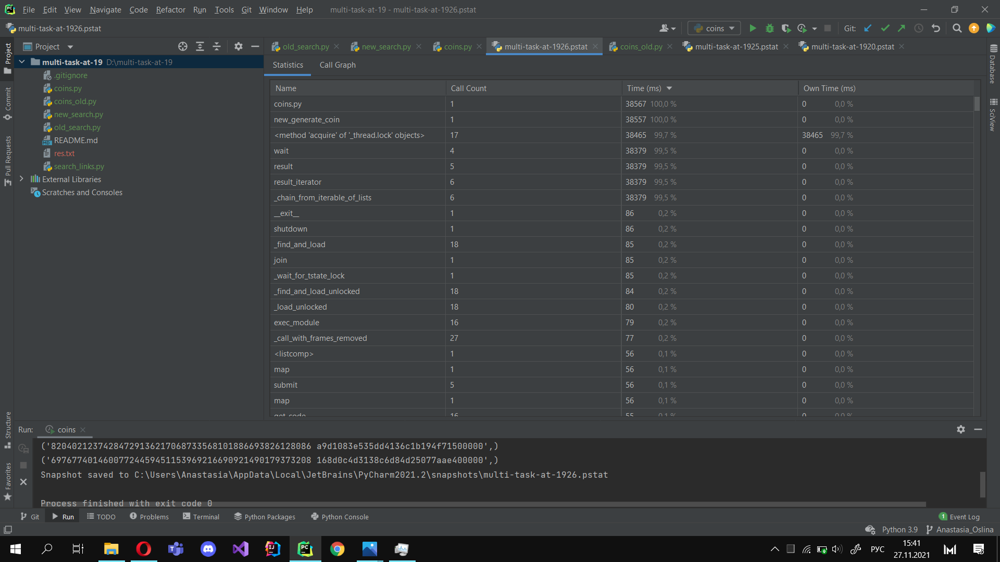
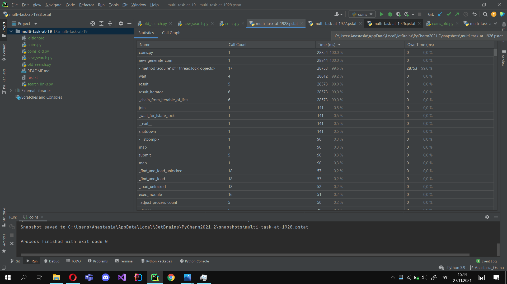
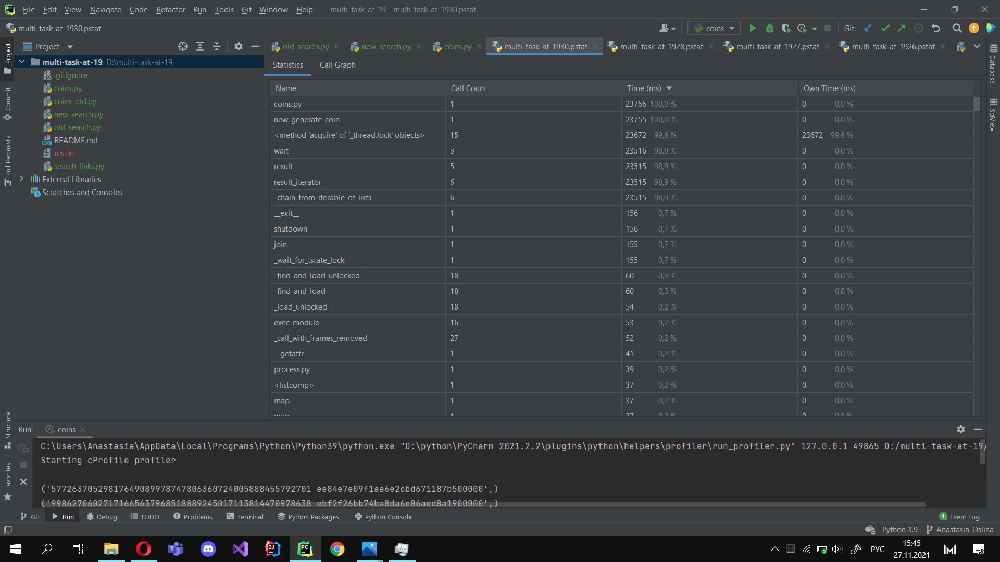

# Отчет
## Задача IO Bound
### Синхронный проход по 100 ссылкам

### Ассинхронный проход по 100 ссылкам

* 5 воркеров

* 50 воркевор

* 100 воркеров

На скринах заметна зависимость производительности программы от количества потоков: чем больше потоков-
тем быстрее программа.

## Задача CPU Bound
### Синхронный поиск одной монеты

### Асинхронный поиск 3 монет
* 2 воркера

* 4 воркера

* 61 воркер

С увеличением количества процессов, скорость работы программы тоже увеличивается.
Но скорость программы также зависит от количества логических ядер компьютера, если количество
процессов будет их превышать, то это несущественно скажется на производительности программы или даже
снизит ее.